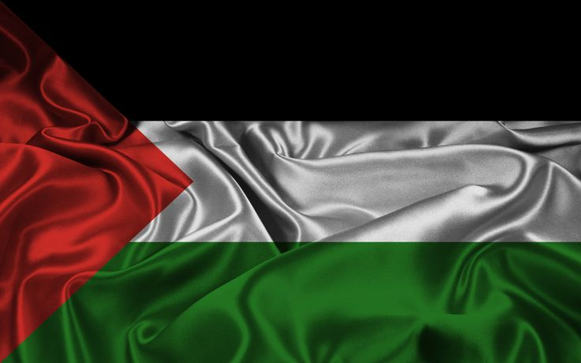

# ☆ Mohamed El-Gedawy

  

### أُذِنَ لِلَّذِينَ يُقَاتَلُونَ بِأَنَّهُمْ ظُلِمُوا ۚ وَإِنَّ اللَّهَ عَلَىٰ نَصْرِهِمْ لَقَدِيرٌ.🫶🏻💗

> "Permission is given to those who are being fought because they were wronged, and indeed Allah is capable of granting them victory." **Surah Al-Hajj (22:39)**
